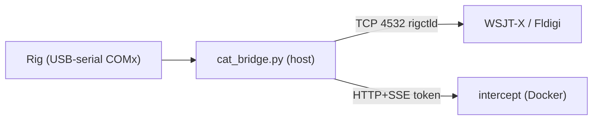

# CAT (Computer Aided Transceiver) Mode

Serial-port control of amateur radio transceivers. Lives under the **Signals** group on the main mode bar and is reachable at `/cat`.

> Status: PR #1 (driver + supervisor + diagnostics + main-view terminal). Panadapter, front-panel view, and the other vendor drivers are deferred to follow-up PRs.

---

## 1. What's in this PR

### Reference driver — Kenwood TS-850S
Full implementation in `utils/cat/kenwood_ts850.py`:

- **ID handshake on connect** — sends `ID;` immediately after the port settles. `ID008` = TS-850 confirmed; anything else (or no reply) is surfaced as a `sys` line in the CAT terminal so the operator finds out at once if the baud/parity/cable is wrong or the wrong Kenwood is wired up.
- Auto-Info (`AI1;`) live frame streaming
- Periodic poll: `IF;` + `SM;` every 0.5 s (or `SM;` every 1.5 s when AI is on) — **togglable** at runtime via `/cat/polling`
- Frame parsers: `IF`, `FA`, `FB`, `MD`, `SM`, `FR`, `FT`, `RT`, `XT`, `FL`, `MC`. Polling and parsing are deliberately limited to commands the TS-850 actually documents — `AGC/AF/RF/SQ/NB/RA/KS/PC` arrived on later Kenwoods (TS-590S, TS-2000) and the 1991-era TS-850 silently rejects them with `?`.
- Modes: `LSB`, `USB`, `CW`, `CW-R`, `AM`, `FM`, `FSK`, `FSK-R` (mode code `8` / `TUNE` is decoded for status only — `set_mode('TUNE')` is intentionally blocked, since `MD8;` keys a steady carrier into the ATU)
- Default serial framing: **4800 8N2** (1 start, 8 data, 2 stop, no parity, per Kenwood TS-850S manual), RTS/DTR de-asserted (TS-850 quirk). All five parameters (baud, data bits, stop bits, parity, RTS/DTR) are per-rig defaults sourced from the registry and can be overridden per connection.

### Vendor catalog (stubs only, no driver code yet)
`utils/cat/registry.py` lists these so the UI can advertise upcoming support. Selecting one returns HTTP 400 `driver_unavailable` until a real driver lands. Each descriptor carries its own serial-framing defaults (`default_baud`, `data_bits`, `stop_bits`, `parity`) so the UI can preset the right values per rig.

| Vendor | Models |
|---|---|
| Kenwood | TS-590S, TS-2000 |
| Yaesu   | FT-991A, FT-DX10, FTX-1 |
| Icom    | IC-7300, IC-7610, IC-705 |
| Xiegu   | G90, X6100 |

### Supervisor — server-side safety
Enforced in `routes/cat.py` *before* any command reaches the rig. Persisted via `get_setting`/`set_setting` under key `cat.supervisor` (no schema migration).

| Setting | Default | Effect |
|---|---|---|
| `tx_locked`   | **on**       | `/cat/ptt` → HTTP 403 `tx_locked`. `/cat/raw` refuses **only commands that physically key the rig** (`TX`, `KY`, `KS` prefixes); query / mode / VFO / AI commands still pass. |
| `band_guard`  | **on**       | `/cat/vfo` outside configured ham bands → HTTP 403 `band_guard` |
| `max_power_w` | `0` (no cap) | When >0, `/cat/power` clamps requested watts and reports both `requested` and applied `watts` |
| `bands`       | HF + 6 m / 2 m / 70 cm | Editable list of `(lo_hz, hi_hz)` ranges |

---

## 2. API

### Status / catalog (GET)
| Endpoint | Description |
|---|---|
| `/cat/rigs` | All rig descriptors with capability tags, serial-framing defaults (`default_baud`, `data_bits`, `stop_bits`, `parity`) and `implemented` flag |
| `/cat/ports` | Available serial ports (`pyserial.tools.list_ports`) |
| `/cat/status` | Current driver + state + supervisor snapshot + `polling_enabled` |
| `/cat/supervisor` | Current supervisor settings |
| `/cat/supervisor/check_freq?hz=…` | Returns `{allowed: bool}` |
| `/cat/polling` | Returns `{enabled: bool}` for the running driver |

### Lifecycle (POST)
| Endpoint | Body |
|---|---|
| `/cat/select` | `{ "rig_id": "kenwood_ts850" }` |
| `/cat/connect` | `{ "port": "/dev/ttyUSB0", "baud": 4800, "data_bits": 8, "stop_bits": 2, "parity": "N", "use_auto_info": true, "assert_rts": false, "assert_dtr": false }` — framing fields default to the selected rig descriptor when omitted |
| `/cat/disconnect` | `{}` |
| `/cat/refresh` | `{}` — re-poll `IF;` |
| `/cat/polling` | `{ "enabled": bool }` — turn the safety-net poll on/off without reconnecting |
| `/cat/probe` | `{ "port": "…", "baud": 4800, "data_bits": 8, "stop_bits": 2, "parity": "N", "assert_rts": false, "assert_dtr": false, "timeout": 1.0 }` — stand-alone cable diagnostic, refuses while a driver is connected (HTTP 409 `busy`). Sends `AI0; ID; IF; FA;` and returns per-query ASCII + hex + byte counts plus a verdict string. Modeled on `port/source/plugins/panadapter/diag.py::radio_probe()`. |

### Control (POST)
| Endpoint | Body | Supervisor gate |
|---|---|---|
| `/cat/vfo`        | `{ "which": "A"\|"B", "hz": int }` | band-guard |
| `/cat/mode`       | `{ "mode": "USB" }` | — |
| `/cat/split`      | `{ "on": bool }` | — |
| `/cat/rit`        | `{ "hz": int, "on": bool }` | — |
| `/cat/rit/clear`  | `{}` | — |
| `/cat/ptt`        | `{ "tx": bool }` | **tx-lock** |
| `/cat/raw`        | `{ "cmd": "IF;" }` | **tx-lock** (only commands beginning with `TX` / `KY` / `KS` are refused while locked) |
| `/cat/agc`        | `{ "agc": 0..2 }` | — |
| `/cat/filter`     | `{ "slot": int }` | — |
| `/cat/nb`         | `{ "on": bool }` | — |
| `/cat/attenuator` | `{ "level": int }` | — |
| `/cat/af_gain`    | `{ "value": 0..255 }` | — |
| `/cat/rf_gain`    | `{ "value": 0..255 }` | — |
| `/cat/squelch`    | `{ "value": int }` | — |
| `/cat/keyer`      | `{ "wpm": int }` | — |
| `/cat/power`      | `{ "watts": int }` | **power-cap** |
| `/cat/step`       | `{ "hz": int }` | — |
| `/cat/supervisor` | partial settings dict | — |

> Endpoints whose underlying CAT command isn't documented by the connected rig return **HTTP 400 `unsupported`** without touching the wire. On the TS-850 that applies to `/cat/agc`, `/cat/nb`, `/cat/attenuator`, `/cat/af_gain`, `/cat/rf_gain`, `/cat/squelch`, `/cat/keyer`, and `/cat/power` — use macros built from the catalog instead (e.g. AIP, Lock, CW Pitch) for things the rig *does* support but doesn't have a dedicated REST verb.

### Live stream
`GET /cat/stream` — Server-Sent Events. Multi-tab safe via `sse_stream_fanout`.

Event types: `state`, `supervisor`, `io`, `lifecycle` (`lifecycle.event` is one of `connected` / `disconnected` / `polling`).

---

## 3. Frontend

The UI is split between a thin sidebar (rig controls that don't need real estate) and the **main view** (`#catVisuals`) which renders a CAT terminal as the primary work surface. The main view is visible on every viewport — there are no mobile-only controls hidden in the sidebar.

### Sidebar — `templates/partials/modes/cat.html`
- **VFO & Mode** — VFO A/B inputs with `Set` and `RX A`/`RX B` buttons, mode dropdown, Split / RIT toggles.
- **Supervisor** — TX-lock, band-guard, power-cap controls.

### Main view — `#catVisuals` in `templates/index.html`
- **Connection panel** (collapsible `<details>`) — transceiver, serial port, baud, data / parity / stop, RTS/DTR, Connect / Disconnect. Auto-collapses on successful connect and re-opens on disconnect. Framing fields auto-fill from the selected rig descriptor (TS-850 → `8N2`, FTX-1 → `8N1`).
- **Toolbar** — RIG name badge, connection-state dot, `autoscroll` checkbox, `poll` checkbox (toggles `/cat/polling` at runtime), `clear`, **Probe** (runs `/cat/probe` diagnostic and echoes results to the terminal), `Poll IF;` (one-shot refresh).
- **CAT terminal** — colour-coded log of every TX / RX frame, system messages, and probe verdicts. Capped at ~500 lines.
- **Raw input** — type a command and press Enter or click **Send**. Trailing `;` is added automatically. While TX-lock is on, only `TX` / `KY` / `KS` commands are refused; queries and mode/VFO/AI commands work freely.
- **Live state** pane — human-readable summary of `RigState` (VFO A/B, mode, split, RIT, PTT, S-meter, AGC, AF/RF/SQL, power, keyer).

### Controller — `static/js/modes/cat.js`
IIFE `CATMode` matching the pattern of every other mode module. Uses `EventSource('/cat/stream')` and won't overwrite an input while the user is typing in it. Public surface: `init`, `destroy`, `connect`, `disconnect`, `refreshPorts`, `setVfo`, `selectVfo`, `setMode`, `setSplit`, `setRit`, `clearRit`, `sendRaw`, `updateSupervisor`, `probe`, `clearTerminal`, `refreshStatus`, `togglePolling`.

### Styles
`static/css/modes/cat.css` — scoped, uses existing CSS tokens (`--accent`, `--accent-cyan`, `--accent-green`, `--accent-red`, `--bg-card`, `--border-dim`, `--font-mono`, `--text-dim`).

### Wiring in `templates/index.html`
CSS map, JS map, mode card under Signals, partial include, `modeCatalog` entry, destroy map, switch-mode branch, plus a `catVisuals` entry in the `modesWithVisuals` list and a `display: flex / none` toggle in the mode-switch handler.

---

## 4. Testing in Docker

The CAT mode talks to a transceiver over a USB↔Serial adapter (FTDI / Prolific / CH340). The container must be able to see that `/dev/tty*` device.

### 4.1 Linux host

1. Plug the adapter in and find its path:
   ```bash
   ls /dev/ttyUSB* /dev/ttyACM*
   dmesg | tail   # confirms FTDI/CH340/etc.
   ```
2. Edit [docker-compose.yml](../docker-compose.yml) and uncomment the matching device line under the `intercept` service:
   ```yaml
   devices:
     - /dev/bus/usb:/dev/bus/usb
     - /dev/ttyUSB0:/dev/ttyUSB0     # ← uncomment / adjust
   ```
   (The device must exist on the host **before** `docker compose up`; otherwise compose fails with "no such file".)
3. The container already runs `privileged: true`, so it can open the device once it's mapped. If you've dropped privileged in your own deploy, also set:
   ```yaml
   group_add:
     - "20"          # `getent group dialout | cut -d: -f3` on the host
   ```
4. Start:
   ```bash
   docker compose --profile basic up -d --build
   ```
5. Open `http://localhost:5050/`, log in, switch to **CAT** under the Signals group.
6. In the main view, open the **Connection** drawer (top of `#catVisuals`):
   - **Rig**: `Kenwood TS-850S` — picking the rig auto-fills the framing fields below.
   - **Port**: should list `/dev/ttyUSB0` (hit *Rescan* if not)
   - **Baud / Data / Parity / Stop**: `4800 / 8 / N / 2` (preset from the TS-850 descriptor — per Kenwood manual: 1 start, 8 data, 2 stop, no parity)
   - **RTS / DTR**: both **off** (TS-850 quirk)
   - Click **Connect**. The drawer collapses, the RIG badge lights up, and the CAT terminal starts logging frames.
7. If nothing comes back, click **Probe** before fiddling with cables. It runs `/cat/probe` against the same port/framing with the driver detached, sends `ID; IF; FA;`, and prints ASCII + hex + a verdict so you can tell "no bytes at all" from "wrong baud / framing".
8. Try read-only commands (everything except PTT / explicit TX-keying raw commands is gated only by band-guard):
   - Type a VFO A frequency inside a ham band (e.g. `14250000` Hz) → **Set A**.
   - Watch the terminal for `→ FA00014250000;` and the rig response.
9. **TX is locked by default.** Status queries, mode changes, and Auto-Info commands all still work. To actually key the rig (`/cat/ptt`, `TX;`, `KY…;`), uncheck **TX locked** in the Supervisor sidebar first. Then test with the rig's antenna disconnected or into a dummy load.
10. The toolbar **poll** checkbox toggles the safety-net `IF; SM;` poll loop at runtime. With Kenwood Auto-Info on it's mostly redundant; turn it off if you want a strictly event-driven trace.

### 4.2 Windows / WSL2 host

USB↔Serial passthrough into WSL2 needs `usbipd-win` (already documented in `docker-compose.override.yml` for SDR dongles — same procedure applies):

```powershell
winget install dorssel.usbipd-win        # one time
usbipd list                              # find BUSID of the serial adapter
usbipd bind --busid <BUSID>              # one time per device (elevated)
usbipd attach --wsl --busid <BUSID>      # each session
```

Then in WSL the adapter appears as `/dev/ttyUSB0`. Proceed with step 2 above.

#### 4.2.1 Connection drops under Docker Desktop

Native WSL2 talks to `/dev/ttyUSB0` over a stable kernel driver. Docker Desktop adds a second layer (`usbipd-win` → WSL2 distro → Docker VM bind-mount), and any of these links can blip:

- After **suspend / resume** of the host, usbipd-win silently detaches.
- After **unplugging and re-plugging** the adapter, the BUSID is the same but the device node inside the container points at a now-dead handle until the container is recreated.
- A noisy USB hub or a short PSU brown-out can drop the device for a fraction of a second; pyserial then keeps raising `OSError` on every subsequent read.

Symptoms in the CAT terminal: TX frames stop echoing, no RX, the LIVE STATE box freezes on the last known values.

The driver now detects this: after `SERIAL_FAIL_LIMIT` (10) consecutive read/write errors it closes the port, flips the rig to **Disconnected**, and pushes a `sys` line into the terminal like:

```
[hh:mm:ss] · serial link lost (…) — disconnect and reconnect the rig from the Connection panel
```

When that happens, the recipe is:

```powershell
usbipd detach --busid <BUSID>
usbipd attach --wsl --busid <BUSID>
docker compose --profile basic up -d --force-recreate intercept
```

If you only see the issue intermittently and not after a re-attach, the simplest workaround is to bypass Docker Desktop and run intercept directly in the WSL2 distro (`pip install -r requirements.txt && python app.py`) — the serial path is much shorter and considerably more stable.

### 4.3 Without hardware (sanity check only)

You can still verify the wiring without a rig:

```bash
docker compose --profile basic up -d --build
curl -s http://localhost:5050/cat/rigs       | jq '.rigs[].rig_id'
curl -s http://localhost:5050/cat/ports      | jq
curl -s http://localhost:5050/cat/status     | jq
curl -s http://localhost:5050/cat/supervisor | jq
```

(Adjust for your auth — log in via the UI first and reuse the session cookie, or set `INTERCEPT_DISABLE_AUTH=true` in compose for local testing only.)

---

## 5. Tests

```bash
pytest tests/test_cat_registry.py tests/test_cat_driver.py tests/test_cat_routes.py -v
```

- `test_cat_registry.py` — 5 tests: descriptor catalog, sort order, `to_dict` round-trip.
- `test_cat_driver.py` — 13 tests: parser for every supported frame type plus command formatting and input validation. **No serial port required** — the driver is instantiated via `__new__` and frames are fed directly into `_parse()`.
- `test_cat_routes.py` — 15 tests: REST endpoints, supervisor enforcement (band-guard, tx-lock keying-only narrowing, power-cap), 409 when no driver, unimplemented-rig rejection. Driver is mocked.

Tests run on Linux / WSL. On native Windows pytest's conftest fails earlier on an unrelated `termios` import from another route module — run from inside the container or WSL.

---

## 6. File map

| Path | Purpose |
|---|---|
| `utils/cat/__init__.py` | Package façade, `list_serial_ports()` |
| `utils/cat/base.py` | `RigDriver` ABC + `RigState` dataclass |
| `utils/cat/supervisor.py` | `Supervisor` dataclass, `load_supervisor` / `save_supervisor` |
| `utils/cat/registry.py` | `RigDescriptor`, capability constants, `RIG_REGISTRY`, lookups |
| `utils/cat/kenwood_ts850.py` | TS-850S driver implementation |
| `utils/cat/yaesu_ftx1.py`    | Yaesu FTX-1 driver implementation |
| `routes/cat.py` | Blueprint `cat_bp`, REST + SSE endpoints |
| `templates/partials/modes/cat.html` | UI partial |
| `templates/partials/skins/ts850.html` | TS-850S virtual front panel skin |
| `static/js/modes/cat.js` | `CATMode` IIFE controller |
| `static/js/modes/cat-frontpanel.js` | `CATFrontPanel` skin controller (generic) |
| `static/js/core/cat-smeter.js` | `CatSMeter` analog multimeter widget (SVG) |
| `static/css/modes/cat.css` | Scoped styles |
| `static/css/modes/cat-frontpanel.css` | Front panel base (rig-neutral) styles |
| `static/css/skins/ts850.css` | TS-850S skin layout |
| `tests/test_cat_registry.py` | Registry tests |
| `tests/test_cat_driver.py` | Driver / parser tests |
| `tests/test_cat_routes.py` | API + supervisor tests |

Integration touchpoints:

- `app.py` — globals `cat_driver`, `cat_queue`, `cat_lock`
- `routes/__init__.py` — `cat_bp` imported & registered
- `templates/index.html` — CSS map, JS map, Signals mode card, partial include, `modeCatalog`, destroy map, switch-mode branch (8 edits total)

---

## 7. Deferred to follow-up PRs

- Panadapter / waterfall surface bound to VFO A (front-panel spectrum zone is a wired placeholder — see §13.5)
- Additional front-panel skins (Yaesu FTX-1, Icom IC-7300, …) — the generic controller is in place (see §13)
- Real driver code for the remaining stub vendor entries (Kenwood TS-590S/TS-2000, Yaesu FT-991A/FT-DX10, Icom IC-7300/IC-7610/IC-705, Xiegu G90/X6100)
- Memory-channel browser UI
- Per-rig user presets (default band/mode pairs)

---

## 8. Command catalog & Macro Builder

A SQLite catalog of per-rig CAT commands plus a UI for assembling them
into named macros. Backing store: `instance/cat.db` (separate from
`interc_settings.db` so the feature can be enabled/disabled without
touching the main settings file).

**Tables** (`utils/cat/macros_db.py::_SCHEMA`):

- `interc_cat_commands(id, rig_id, category, name, raw_template,
  param_label, param_type, param_default, description, is_builtin)`
- `interc_cat_macros(id, rig_id, name, description, created_at)`
- `interc_cat_macro_steps(id, macro_id, position, command_id,
  param_value, delay_ms, note)` — `ON DELETE CASCADE` from macros.

**Built-ins** (`utils/cat/seed_commands.py`):

- `kenwood_ts850` — ~46 commands across `frequency`, `mode`, `split`,
  `rit`, `ptt`, `dsp`, `memory`, `misc`, `status`. Scope is the
  TS-850 *Operating Manual* command set only (AI, DN/UP, FA/FB, FL,
  FR/FT, ID, IF, LK, MC, MD, MR, MW, MX, PT, RC, RD/RU, RM, RT,
  RX/TX, SC, SH/SL, SM, TN, VR, XT). Commands inherited from later
  Kenwoods (AGC/AF/RF/SQ/NB/RA/KS/PC) are deliberately *not* in this
  list — the rig rejects them with `?`.
- `yaesu_ftx1` — ~31 commands. Live serial driver in
  `utils/cat/yaesu_ftx1.py` (Yaesu CAT v2, 38400 8N1). Covers VFO A/B,
  mode (`MD0Mx`), split (`STx`), RIT, PTT (`TX0`/`TX1`), power, AGC,
  NB, S-meter (`SM0;`) and IF status. Channel-1 (Sub) commands are
  not yet wired — see the [FTX-1 reference](cat/FTX1_REFERENCE.md).

Seeds run at startup from `app.py::_init_app()` via
`utils.cat.init_command_catalog()`. On every start the loader calls
`macros_db.reseed_builtins(rig_id, cmds)` which deletes only rows
flagged `is_builtin = 1` and reinserts the current list. **User-added
commands (`is_builtin = 0`) and saved macros are preserved**; macro
steps that referenced a deleted built-in keep their `raw_command`
(already wire-ready) via the schema's `ON DELETE SET NULL` on
`interc_cat_macro_steps.command_id`. This means corrections to the
seed list (e.g. dropping commands the rig never supported) propagate
automatically to existing `cat.db` files without manual DB surgery.

**REST endpoints** (added to `routes/cat.py`):

| Method | Path                          | Notes                                |
|--------|-------------------------------|--------------------------------------|
| GET    | `/cat/commands`               | Query: `rig_id`, `q`, `category`     |
| POST   | `/cat/commands`               | Add user-defined command             |
| DELETE | `/cat/commands/<id>`          | Refuses built-ins                    |
| GET    | `/cat/macros`                 | List macros for a rig                |
| GET    | `/cat/macros/<id>`            | Full macro with steps                |
| POST   | `/cat/macros`                 | Upsert by `(rig_id, name)`           |
| DELETE | `/cat/macros/<id>`            | Cascades to steps                    |
| POST   | `/cat/macros/<id>/run`        | Pre-flight TX-lock gate, then run    |

`/cat/macros/<id>/run` walks the step list and calls `driver.send_raw()`
for each rendered frame, honoring per-step `delay_ms`. If TX is locked
and *any* step's `raw_command` matches `_command_keys_tx()`, the whole
macro is refused before sending a single byte (HTTP 403 `tx_locked`).
A `macro` event is also echoed onto the CAT SSE stream so the terminal
shows the run summary.

**UI**: collapsible `<details id="catMacroPanel">` between the
Connection panel and the terminal. Two columns — left = command
catalog (filter + category select), right = saved macros / step
editor. All JS lives in `static/js/modes/cat.js::CATMode::Macros`.
Re-fetches automatically when the rig picker changes.

---

## 9. Persistent connection preferences

Per-rig serial settings are remembered between sessions so the operator
doesn't have to re-pick the COM port, baud and RTS/DTR flags on every
visit. Storage is **client-side `localStorage`** under the key
`intercept.cat.prefs.v1` with shape:

```jsonc
{
  "kenwood_ts850": {
    "port": "COM3", "baud": "4800",
    "data_bits": "8", "stop_bits": "2", "parity": "N",
    "assert_rts": true, "assert_dtr": false
  },
  "yaesu_ftx1": { /* … */ }
}
```

Saved automatically on every change of the connection fields and again
on a successful `Connect`. Restored on rig-picker change and after
`/cat/ports` resolves (so a `COM3` value that doesn't exist on the
current host is silently ignored rather than corrupting the form).

`localStorage` was chosen over a server-side `interc_settings` row
because these are per-workstation operator preferences — two operators
sharing one Intercept instance keep their own COM-port choice without
clobbering each other.

## 10. UI affordances

* **Connection summary** in the collapsed `catConnectPanel` reflects
  live state: `"Kenwood TS-850S · connected · COM3 @ 4800"` while
  connected, `"… · choose port"` otherwise. Re-renders on connect,
  disconnect, every form change, and every SSE state push.
* **RECON panel and the bottom status-bar are hidden in CAT mode** —
  neither belongs to a rig-control conversation. Configured via the
  `hideRecon` / `hideStatusBar` mode-lists in
  `templates/index.html`'s `switchMode()` block.
* **Terminal resize handle** uses an explicit `height: 360px` (with
  `resize: vertical` and `max-height: 80vh`) instead of a flex-grown
  size, because `resize` requires a definite height on the element
  itself.

## 11. Timing & cooldowns

The TS-850 over an FTDI USB-serial cable is sensitive to back-to-back
writes — frames sent <30 ms apart can be silently merged or dropped by
the radio's UART. The driver mitigates this at three points:

* **`POST_OPEN_SETTLE_S = 0.25`** in
  `utils/cat/kenwood_ts850.py::start()` — quiet window after the port
  is opened (and RTS/DTR set) before the first `AI1;`/`IF;` leaves the
  host. Eliminates the "first connect doesn't respond" race.
* **`INTER_COMMAND_DELAY_S = 0.05`** in the TX-drain loop in `_run()` —
  inserted only when another frame is already queued, so single
  commands keep their original latency.
* **Flush after every write** so the FTDI bridge cannot coalesce two
  CAT frames into one USB packet.

At the route layer, `_RECONNECT_SETTLE_S = 1.2` enforces a minimum gap
between connect/disconnect operations. The stamp is now updated on
*both* paths, and `/cat/disconnect` returns `cooldown_ms` so the JS
greys out the Connect button (`Wait 1.2s`) for the duration. Defends
against the operator double-clicking Connect/Disconnect before the COM
port has fully released.

## 12. Host serial bridge + rigctld relay (optional)

Running pyserial *inside* the Docker container is fragile on Windows:
`usbipd-win -> WSL2 distro -> Docker Desktop VM` is a three-hop path, and
the device frequently lands in the wrong VM or loses its sysfs metadata,
so `/cat/ports` comes up empty "sometimes." The optional **CAT bridge**
sidesteps that entirely by owning the serial port on the host and letting
the container talk to it over the network.

This is strictly opt-in. It adds **no new dependencies** (Flask +
pyserial are already required) and changes nothing unless you set
`CAT_BRIDGE_URL`. With it unset, intercept uses the in-container driver
exactly as before.

### 12.1 What it provides

- `cat_bridge.py` — a standalone process that owns one rig via the same
  `utils/cat` drivers and exposes:
  - an HTTP + SSE API (`/ports`, `/status`, `/stream`, `/connect`,
    `/disconnect`, `/rpc`) for the container, protected by a bearer token
    and the `ALLOWED_IPS` IP allowlist;
  - a **rigctld-compatible TCP relay** (`utils/cat/rigctld_relay.py`,
    default port `4532`) so WSJT-X / Fldigi / JS8Call / Gpredict can drive
    the same radio.
- `routes/cat.py` proxy mode — when `CAT_BRIDGE_URL` is set, `/cat/ports`
  and connect/control/SSE transparently target the bridge through
  `utils/cat/bridge_client.py::RemoteDriverProxy`. The Supervisor (TX
  lock / band guard / power cap) still applies to the web UI.



### 12.2 Install requirement

The bridge needs **Python 3 + pyserial on the host** (the machine the
cable is plugged into). On Windows: `pip install pyserial flask requests`
(or reuse the intercept venv). Nothing else is required.

### 12.3 Run the bridge (Windows host example)

```powershell
cd path\to\intercept
$env:CAT_BRIDGE_TOKEN = "change-me"
$env:ALLOWED_IPS = "127.0.0.1/8,::1,172.16.0.0/12"   # allow Docker bridge net
python cat_bridge.py
```

If `CAT_BRIDGE_TOKEN` is unset the bridge generates one, prints it, and
writes it to `instance/cat_bridge_token` — copy it into the container.

#### Bridge environment variables (set on Windows host):

| Variable | Default | Description |
|----------|---------|-------------|
| `CAT_BRIDGE_TOKEN` | (generated) | Shared secret — must match Docker's `CAT_BRIDGE_TOKEN` |
| `ALLOWED_IPS` | `127.0.0.1/8,::1` | Comma-separated IPs/CIDRs allowed to connect |
| `CAT_BRIDGE_HOST` | `0.0.0.0` | HTTP API bind address |
| `CAT_BRIDGE_PORT` | `5060` | HTTP API port |
| `RIGCTLD_ENABLE` | `1` | `0` to disable rigctld relay |
| `RIGCTLD_HOST` | `0.0.0.0` | rigctld bind address |
| `RIGCTLD_PORT` | `4532` | rigctld TCP port |
| `BRIDGE_TX_LOCK` | `1` | `0` to allow PTT from rigctld clients |
| `CAT_BRIDGE_DEBUG` | `0` | `1` for verbose connection logging |
| `RIGCTLD_DEBUG` | `0` | `1` for rigctld command logging |

A convenience script `catbridge.ps1` is included with sensible defaults.

#### Container environment variables (set in docker-compose.yml):

| Variable | Example | Description |
|----------|---------|-------------|
| `CAT_BRIDGE_URL` | `http://host.docker.internal:5060` | Bridge HTTP API URL |
| `CAT_BRIDGE_TOKEN` | `change-me` | Must match the host's token |

### 12.4 Point the container at the bridge

In [docker-compose.yml](../docker-compose.yml), uncomment under the
`intercept` service environment:

```yaml
environment:
  - CAT_BRIDGE_URL=http://host.docker.internal:5060
  - CAT_BRIDGE_TOKEN=change-me-to-match-the-bridge
```

The `extra_hosts: ["host.docker.internal:host-gateway"]` entry (already
added) makes that hostname resolve on Linux engines too. In bridge mode
you do **not** need the `/dev/ttyUSB0` device mapping. Recreate:
`docker compose up -d --force-recreate`.

Then in the CAT UI, pick the rig, choose the port the bridge reports
(e.g. `COM3`), and Connect. `Probe` is disabled in bridge mode because
the serial port is owned by the bridge host.

### 12.5 Use from WSJT-X / Fldigi

Set the rig to **Hamlib NET rigctl** and the network server to
`<bridge-host-ip>:4532`. The bridge answers `dump_state` with generic
HF + 6 m coverage. To let those apps key the rig, start the bridge with
`BRIDGE_TX_LOCK=0` (PTT is refused by default for safety).

### 12.6 Debugging and monitoring

When `CAT_BRIDGE_DEBUG=1`, the bridge logs:
- New connections (IP address, endpoint)
- Denied connections (IP not in allowlist or bad token)
- Rig connect/disconnect events with port and baud rate

The bridge startup banner displays:
- Host machine name and IP addresses
- Configured allowlist
- Detected serial ports
- Token hint for Docker configuration

The `/info` endpoint (authenticated) returns full bridge status including
connected clients, configuration, and available ports.

In the Intercept CAT UI, a **BRIDGE** badge appears next to the rig name:
- **Green**: Bridge mode active and reachable
- **Red (blinking)**: Bridge configured but unreachable

The connection summary also shows `[via bridge]` when connected through
the host bridge.

### 12.7 WSL alternative

If you prefer, run the bridge inside the WSL2 distro where `usbipd
attach --wsl` placed the device (`/dev/ttyUSB0`); set
`CAT_BRIDGE_HOST=0.0.0.0` and point the container at the WSL host IP.
The Windows-native option is recommended because COM enumeration there
needs no usbipd at all.

---

## 13. Virtual front panel

An optional, skinnable hardware replica that runs as an alternate view
inside the CAT module. The operator toggles between **Terminal** and
**Front Panel** from the CAT header; the choice is persisted in
`localStorage` (`cat.view`). The TS-850S ships first.

### 13.1 Architecture (Skin + Controller)

- **Skin** = a plain HTML partial (`templates/partials/skins/<skin>.html`)
  plus a CSS file. It defines *appearance* only.
- **Controller** = one shared script (`static/js/modes/cat-frontpanel.js`,
  `window.CATFrontPanel`) that loads skins, dispatches events to the
  existing `/cat/*` endpoints, and renders `RigState` back into the skin.

The controller never references rig-specific element IDs. Instead the
skin declares behaviour through **data-attributes**, so adding a rig is a
content task, not a code task.

**Interaction contract** (attributes on skin elements):

| Attribute | Behaviour |
|---|---|
| `data-act="power"` | Connect / disconnect (delegates to `CATMode`) |
| `data-act="ptt"` | Toggle PTT (`POST /cat/ptt`) |
| `data-act="vfo-dial"` | Wheel = `POST /cat/step`; click = enter Hz → `POST /cat/vfo` |
| `data-act="step" data-dir="up\|down"` | `POST /cat/step` |
| `data-act="mode" data-mode-a data-mode-b` | Toggle two modes (`POST /cat/mode`) |
| `data-act="mode-set" data-mode="CW"` | Set one mode |
| `data-act="select-vfo" data-vfo="A\|B"` | `POST /cat/vfo {select:true}` |
| `data-act="split-toggle"` / `"rit-toggle"` | `POST /cat/split` / `/cat/rit` |
| `data-act="filter-cycle"` / `"nb-toggle"` | `POST /cat/filter` / `/cat/nb` |
| `data-knob="squelch\|power\|af\|rf\|agc\|atten\|keyer"` | Wheel = adjust, click = enter value |

**State rendering** (read from a `RigState` dict, no IDs hard-coded):

| Attribute / class | Field |
|---|---|
| `[data-role="freq"]` | active VFO frequency (formatted `MHz.kHz.hHz`) |
| `.fp-mode-chip[data-mode]` | lit when `state.mode` matches |
| `[data-role="split"\|"rit"\|"xit"\|"memch"\|"offset"]` | indicator chips |
| `[data-led="onair"]` | lit on `state.ptt` |
| `[data-role="smeter-host"\|"smeter-val"\|"smeter-dbm"]` | analog meter + readout |
| `[data-knob-val="<knob>"]` | numeric knob readouts |

### 13.2 Capability awareness

Controls are wired only if the rig advertises the matching capability in
`utils/cat/registry.py`. Unsupported controls still render but get the
`.fp-disabled` class and a tooltip. Consequently the TS-850's AF/RF/SQL/
PWR knobs are inert (that firmware never exposed them over CAT) while
VFO, mode, split, RIT, filter, step and PTT are live. The capability list
comes straight from `GET /cat/rigs` (`rig.capabilities`).

### 13.3 Backend route

`GET /cat/frontpanel/<rig_id>` returns the skin HTML. A `rig_id → skin`
allowlist (`_FRONTPANEL_SKINS` in `routes/cat.py`) constrains the rendered
template so the URL can never select an arbitrary template (no path
traversal). Unknown rigs return `404 no_skin`.

### 13.4 Analog multimeter

`static/js/core/cat-smeter.js` (`window.CatSMeter`) is a self-contained,
pure-SVG widget — no bitmap assets. It draws stacked S / PO / SWR / Id /
COMP scales sharing one needle. The controller feeds it `state.s_meter`
on RX and `state.power_w` while transmitting.

### 13.5 Spectrum placeholder

The skin includes a panadapter zone (`data-act="spec-start"/"spec-stop"`,
`[data-role="spec-status"]`) wired to a "coming soon" state. The actual
SDR spectrum integration will be added in a later step.

### 13.6 Adding a new rig skin

1. Author `templates/partials/skins/<skin>.html` using the data-attribute
   contract above (root element `class="cat-fp-stage <skin>-skin"`).
2. Add `static/css/skins/<skin>.css` for that rig's layout/brand (the base
   chrome lives in `static/css/modes/cat-frontpanel.css`).
3. Register the rig in two places:
   - `SKINS` in `static/js/modes/cat-frontpanel.js` (name + skin CSS URLs).
   - `_FRONTPANEL_SKINS` in `routes/cat.py` (`rig_id → skin` stem).

No controller JavaScript changes are required.
